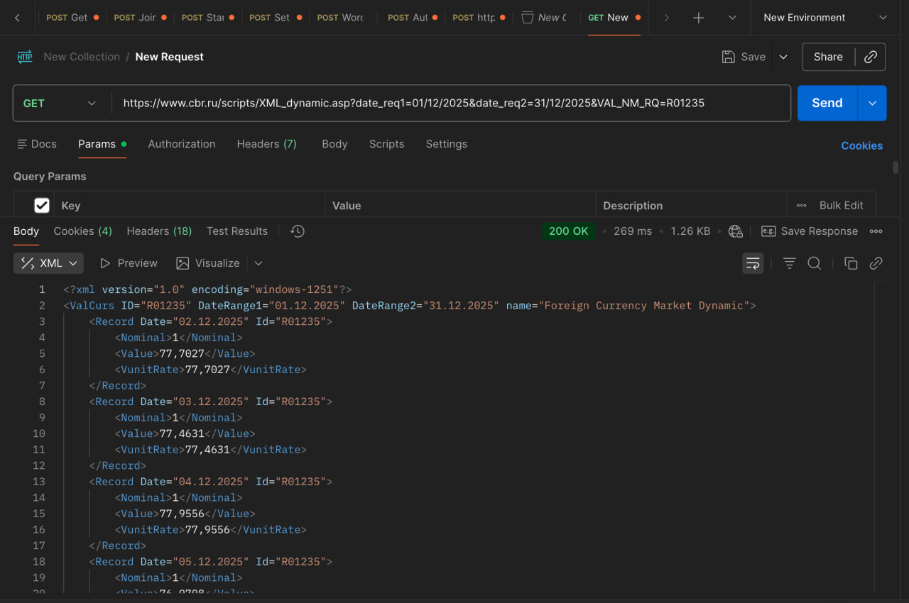

## 1. Отправка HTTP-запросов через Telnet

### GET-запрос

Для отправки GET-запроса было установлено TCP-соединение с сервером `example.com`
на 80 порту с помощью утилиты Telnet. HTTP-запрос был введён вручную
в соответствии со спецификацией HTTP/1.1.

**Запрос:**

GET / HTTP/1.1
Host: example.com
Connection: close


**Результат:**  
Сервер вернул ответ с кодом `200 OK` и HTML-страницу.

---

### POST-запрос

POST-запрос был отправлен аналогичным способом через Telnet.
В теле запроса были переданы тестовые данные.

**Запрос:**

```http
POST / HTTP/1.1
Host: example.com
Content-Type: application/x-www-form-urlencoded
Content-Length: 11
Connection: close

name=rafael


**Результат:**  
Сервер вернул код `405 Method Not Allowed`, что означает,
что метод POST был успешно принят, но не поддерживается данным ресурсом.

---

## 2. Отправка HTTP-запросов с помощью cURL

### GET-запрос

GET-запрос был отправлен с помощью утилиты `curl`.

curl -i http://httpbin.org/get

Сервер вернул код 200 OK и JSON-ответ с информацией о запросе.

js-20-10-2025-2@MacBook-Air-admin-126 ~ % curl -i http://httpbin.org/get
HTTP/1.1 200 OK
Date: Fri, 09 Jan 2026 20:39:17 GMT
Content-Type: application/json
Content-Length: 253
Connection: keep-alive
Server: gunicorn/19.9.0
Access-Control-Allow-Origin: *
Access-Control-Allow-Credentials: true

{
  "args": {}, 
  "headers": {
    "Accept": "*/*", 
    "Host": "httpbin.org", 
    "User-Agent": "curl/8.7.1", 
    "X-Amzn-Trace-Id": "Root=1-69616775-07fb34c45eee381972b0378c"
  }, 
  "origin": "89.37.185.230", 
  "url": "http://httpbin.org/get"
}

### POST-запрос

POST-запрос с JSON-телом был отправлен следующим образом:

curl -i http://httpbin.org/post \
  -H "Content-Type: application/json" \
  -d '{"name":"Rafael","task":"curl"}'


Сервер вернул код 200 OK и отразил переданные данные в ответе:


js-20-10-2025-2@MacBook-Air-admin-126 ~ % curl -i http://httpbin.org/post \
  -H "Content-Type: application/json" \
  -d '{"name":"Rafael","task":"curl"}'

HTTP/1.1 200 OK
Date: Fri, 09 Jan 2026 20:39:49 GMT
Content-Type: application/json
Content-Length: 469
Connection: keep-alive
Server: gunicorn/19.9.0
Access-Control-Allow-Origin: *
Access-Control-Allow-Credentials: true

{
  "args": {}, 
  "data": "{\"name\":\"Rafael\",\"task\":\"curl\"}", 
  "files": {}, 
  "form": {}, 
  "headers": {
    "Accept": "*/*", 
    "Content-Length": "31", 
    "Content-Type": "application/json", 
    "Host": "httpbin.org", 
    "User-Agent": "curl/8.7.1", 
    "X-Amzn-Trace-Id": "Root=1-69616795-7fcf2ea75c69d11c1e7a1bd3"
  }, 
  "json": {
    "name": "Rafael", 
    "task": "curl"
  }, 
  "origin": "89.37.185.230", 
  "url": "http://httpbin.org/post"
}


---

## 3. Получение курса валют через API Банка России

Для получения курса валют был использован публичный XML API Банка России.

Параметры запроса:

Валюта: USD

Период: 01.12.2025 – 31.12.2025

URL запроса:

https://www.cbr.ru/scripts/XML_dynamic.asp?date_req1=01/12/2025&date_req2=31/12/2025&VAL_NM_RQ=R01235


Запрос был выполнен с помощью HTTP-клиента Postman.
В ответе получены данные в формате XML с курсами валют за выбранный период.



